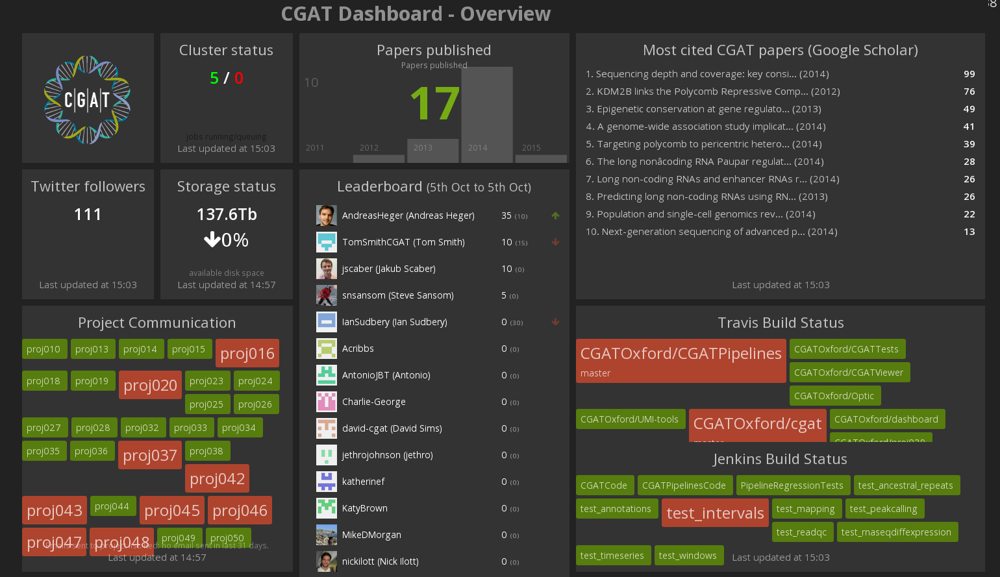
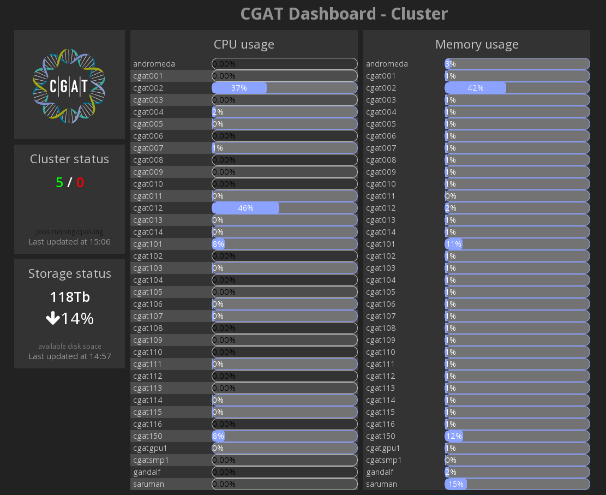
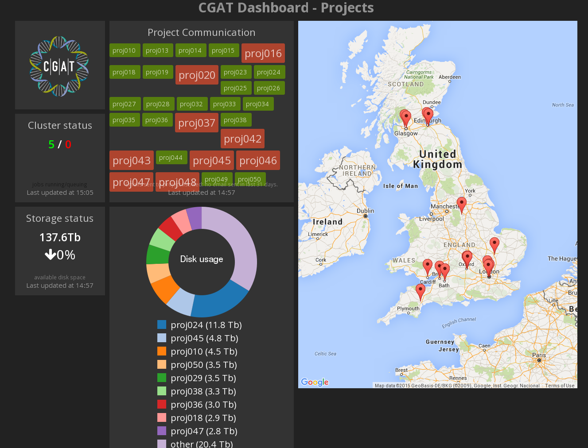
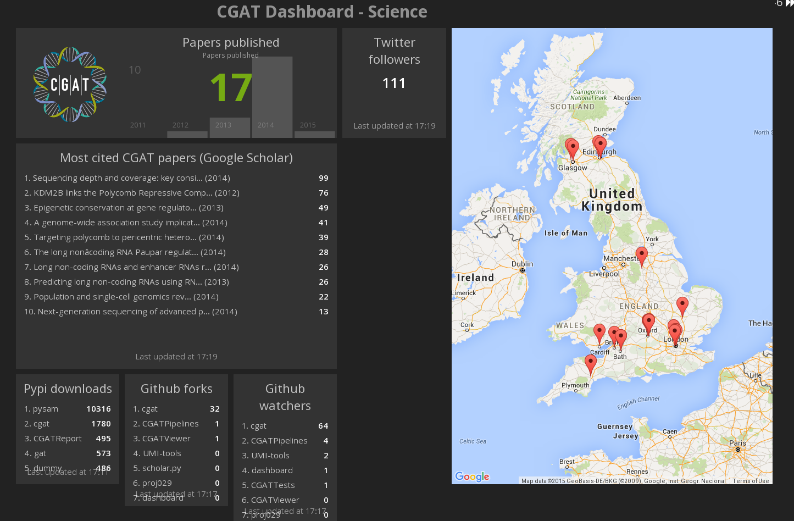
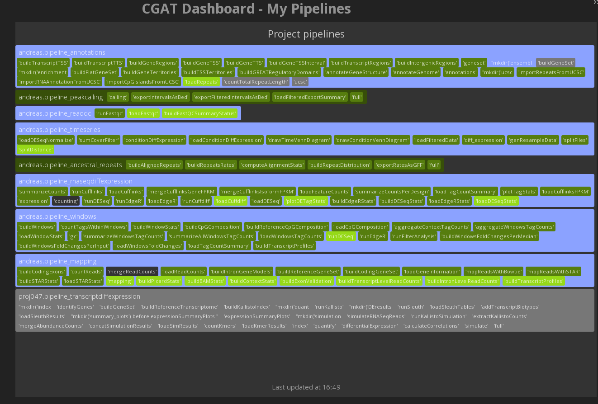

# CGAT Project dashboard

Dashboards to monitor various metrics with the
[CGAT][http://www.cgat.org] programme.

The dashboard has several sections:

* Software - github issues and pull requests, travis build status
* Pipelines - overview of running CGAT Pipelines
* Projects - monitoring of project email lists and locations
* Cluster - monitoring cluster and disk health
* Science - monitoring publication metrics, twitter, etc.

Some screenshots are below:

## Setup

First install the required dependencies through `bundle install`.

The current version is tested with ruby 2.1.5. Version 2.2 failed due
to some incompatabilities with the json gem.

The project is configured through environment variables set in the `.env`
file.

### Leaderboard and software development

All configuration is optional, apart from either `ORGAS` or `REPOS`.

* `ORGAS`: Github organizations. Separate multiple by comma. Will use
   all repos for an organization. Example:
   `silverstripe,silverstripe-labs`.
* `REPOS`: Github repository identifiers. Separate multiple by
   comma. If used alongside `ORGAS`, the logic will add all mentioned
   repos to the ones retrieved from `ORGAS`.  Example:
   `silverstripe/silverstripe-framework,silverstripe/silverstripe-cms`
* `SINCE`: Date string, or relative time parsed through
   [http://guides.rubyonrails.org/active_support_core_extensions.html](ActiveSupport). Example:
   `12.months.ago.beginning_of_month`, `2012-01-01`
* `LEADERBOARD_WEIGHTING`: Comma-separated weighting pairs
   influencing the multiplication of values used for the leaderboard
   widget score.  Example:
   `commits_additions_max=200,commits_additions_loc_threshold=1000,commits_deletions_max=100,commits_deletions_loc_threshold=1000`
* `LEADERBOARD_EDITS_WEIGHTING`: Comma-separated weighting pairs
   influencing the leaderboard widget scores based on lines of code
   added and deleted. The `max` and `threshold` values ensure the
   scores stay in reasonable bounds, and don't bias massive edits or
   additions of third party libraries to the codebase over other
   metrics. Note that the metrics are collected from the "default
   branch" in Github only.  Example:
   `issues_opened=5,issues_closed=5,pull_requests_opened=10,pull_requests_closed=5,pull_request_comments=1,issue_comments=1,commit_comments=1,commits=20`
* `LEADERBOARD_SKIP_ORGA_MEMBERS`: Exclude organization members from leaderboard. Useful to track "external" contributions. Comma-separated list oforganization names.

* `TRAVIS_BRANCH_BLACKLIST`: A blacklist of branches ignored by repo, as a JSON string.
   This is useful to ignore old branches which no longer have active builds.
   Example: `{"silverstripe-labs/silverstripe-newsletter":["0.3","0.4"]}`

* `TRAVIS_REPOSITORY_BLACKLIST`: A blacklist of repositories to ignore.
   Example: `["pysam"]`

### Disk usage

The dashboard scans logs from our storage system to check disk usage per project.

* `PROJECT_IFS_STATS_GLOB`, glob expression for Isilon summary files. The most recent report is used.

### Jenkins pipeline regression tests

The dashboard looks up the status of the regression tests on jenkins.

* `JENKINS_HOST`, IP address of jenkins host.

### Literature citation

To track the number of citations, we download manually the number of citations from Google
Scholar (as html page).

* `SCHOLAR_GLOB`, glob expression for citation lists from Google Scholar. The most recent
  report is used.

### Github API Access

The dashboard uses the public github API, which doesn't require
authentication.  Depending on how many repositories you're showing,
hundreds of API calls might be necessary, which can quickly exhaust
the API limitations for unauthenticated use.

In order to authenticate, create a new
[API Access Token](https://github.com/settings/applications) on your
github.com account, and add it to the `.env` configuration:

	GITHUB_LOGIN=your_login
	GITHUB_OAUTH_TOKEN=2b0ff00...................

The dashboard uses the official Github API client for Ruby
([Octokit](https://github.com/octokit/octokit.rb)), and respects HTTP
cache headers where appropriate to avoid making unnecessary API calls.

## Usage

Finally, start the dashboard server:

	dashing start

Now you can browse the dashboard at `http://localhost:3030/default`.

Alternatively, type:

    rackup -p 3030 -s webrick

## Tasks

The Dashing jobs query for their data whenever the server is started,
and then with a frequency of 1h by default.

# Contributing

Pull requests are very welcome! Please make sure that the code you're
fixing is actually part of this project, and not just generated from
the upstream [Dashing]() library templates.

# Acknowledgements

The original dashboard has been derived from
https://github.com/chillu/github-dashing from the
[SilverStripe CMS](http://silverstripe.org).

# License

Distributed under the MIT license

# Notes

Running dashing in linux but displaying under windows failed. The
widgets were displayed, but did not present any data (only on
closing). The solution was to use a different server (see
https://github.com/Shopify/dashing/issues/235).

To use this, type:

   gem install sentry-raven
   rackup -p 3030 -s webrick

## Dependencies

